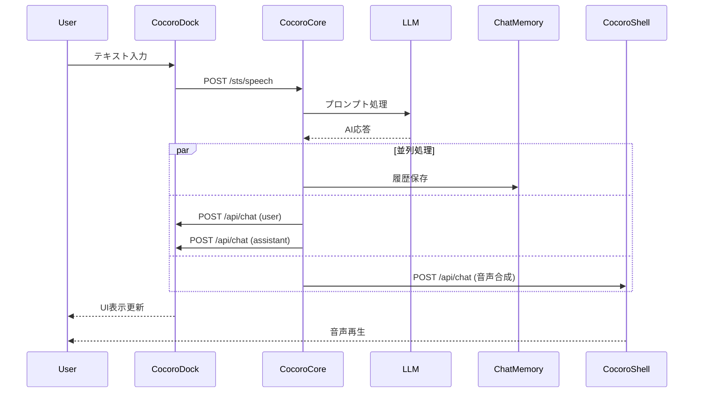
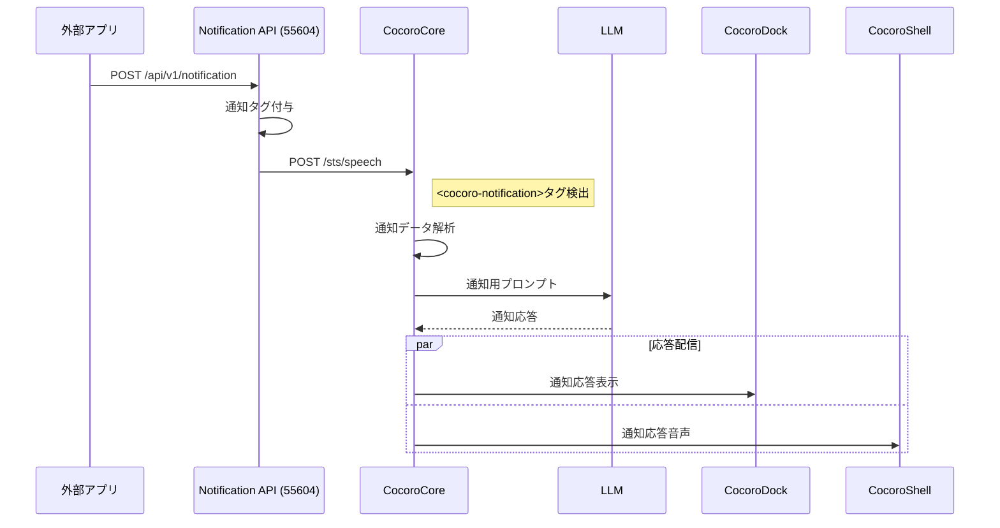

# REST API 通信設計移行計画書

> ⚠️ **重要**: API仕様については必ず [統一API仕様書](../API_SPECIFICATION_UNIFIED.md) を参照してください。この文書は実装の詳細ガイドです。

## 1. 背景と目的

### 1.1 背景

- 現在のCocoroCore は HTTP サーバーとして動作し、AI処理を担当
- WebSocket実装は計画のみで未実装
- CocoroDock、CocoroShell との連携が必要

### 1.2 目的

- すべてのコンポーネント間通信を REST API に統一
- シンプルで保守しやすいアーキテクチャの実現
- 各コンポーネントの責務を明確化

## 2. システムアーキテクチャ

### 2.1 コンポーネント構成

```
┌─────────────┐     ┌──────────────┐
│  外部アプリ  │────▶│ Notification │
└─────────────┘     │API (55604)   │
                    └──────┬───────┘
                           │
                           ▼
┌──────────────┐     ┌──────────────┐     ┌──────────────┐
│  CocoroDock  │◀────│  CocoroCore  │────▶│ ChatMemory   │
│   (55600)    │     │   (55601)    │     │   (55602)    │
└──────────────┘     └──────┬───────┘     └──────────────┘
                            │
                            ▼
                    ┌──────────────┐
                    │ CocoroShell  │
                    │   (55605)    │
                    └──────────────┘
```

### 2.2 各コンポーネントの役割

#### CocoroCore (55601)

- AI処理の中心
- LLM との対話処理
- ChatMemory との連携
- 各コンポーネントへの応答配信

#### CocoroDock (55600)

- UI表示・ユーザーインタラクション
- 設定管理

#### CocoroShell (55605)

- 音声合成
- VRMモデル表示・アニメーション
- 表情制御
- 複数キャラクター対応

#### Notification API (55604)

- 外部アプリからの通知受付
- 通知をCocoroCoreへ転送


## 4. 実装詳細

### 4.1 新規ファイル: src/api_clients.py

```python
import asyncio
from typing import Optional, Dict, Any
import httpx
from datetime import datetime

class CocoroDockClient:
    """CocoroDock との通信を管理するクライアント"""
  
    def __init__(self, base_url: str = "http://localhost:55600", timeout: float = 30.0):
        self.base_url = base_url.rstrip("/")
        self.client = httpx.AsyncClient(timeout=timeout)
        self.retry_count = 3
        self.retry_delay = 1.0
  
    async def send_chat_message(
        self, 
        role: str, 
        content: str, 
        metadata: Optional[Dict[str, Any]] = None
    ) -> bool:
        """チャットメッセージをUIに送信"""
        if metadata is None:
            metadata = {}
      
        if "timestamp" not in metadata:
            metadata["timestamp"] = datetime.now().isoformat()
      
        payload = {
            "role": role,
            "content": content,
            "metadata": metadata
        }
      
        for attempt in range(self.retry_count):
            try:
                response = await self.client.post(
                    f"{self.base_url}/api/chat",
                    json=payload
                )
                response.raise_for_status()
                return True
            except httpx.ConnectError:
                if attempt < self.retry_count - 1:
                    await asyncio.sleep(self.retry_delay)
                    continue
                return False
            except Exception as e:
                log_error(f"CocoroDock送信エラー: {e}")
                return False
  
    async def get_config(self) -> Optional[Dict[str, Any]]:
        """設定を取得"""
        try:
            response = await self.client.get(f"{self.base_url}/api/config")
            response.raise_for_status()
            return response.json()
        except Exception as e:
            log_error(f"設定取得エラー: {e}")
            return None
  
    async def update_config(self, config: Dict[str, Any]) -> bool:
        """設定を更新"""
        try:
            response = await self.client.put(
                f"{self.base_url}/api/config",
                json=config
            )
            response.raise_for_status()
            return True
        except Exception as e:
            log_error(f"設定更新エラー: {e}")
            return False
  
    async def send_control_command(
        self, 
        command: str, 
        params: Optional[Dict[str, Any]] = None
    ) -> bool:
        """制御コマンドを送信"""
        payload = {
            "command": command,
            "params": params or {}
        }
      
        try:
            response = await self.client.post(
                f"{self.base_url}/api/control",
                json=payload
            )
            response.raise_for_status()
            return True
        except Exception as e:
            log_error(f"制御コマンドエラー: {e}")
            return False
  
    async def close(self):
        """クライアントを閉じる"""
        await self.client.aclose()


class CocoroShellClient:
    """CocoroShell との通信を管理するクライアント"""
  
    def __init__(self, base_url: str = "http://localhost:55605", timeout: float = 30.0):
        self.base_url = base_url.rstrip("/")
        self.client = httpx.AsyncClient(timeout=timeout)
        self.retry_count = 3
        self.retry_delay = 1.0
  
    async def send_chat_for_speech(
        self, 
        content: str, 
        voice_params: Optional[Dict[str, Any]] = None,
        animation: Optional[str] = "talk",
        character_name: Optional[str] = None
    ) -> bool:
        """音声合成付きでチャットメッセージを送信"""
        payload = {
            "content": content,
            "voiceParams": voice_params or {},
            "animation": animation
        }
        if character_name:
            payload["characterName"] = character_name
      
        for attempt in range(self.retry_count):
            try:
                response = await self.client.post(
                    f"{self.base_url}/api/chat",
                    json=payload
                )
                response.raise_for_status()
                return True
            except httpx.ConnectError:
                if attempt < self.retry_count - 1:
                    await asyncio.sleep(self.retry_delay)
                    continue
                return False
            except Exception as e:
                log_error(f"CocoroShell送信エラー: {e}")
                return False
  
    async def send_animation(
        self, 
        animation_name: str
    ) -> bool:
        """アニメーションを制御"""
        payload = {
            "animationName": animation_name
        }
      
        try:
            response = await self.client.post(
                f"{self.base_url}/api/animation",
                json=payload
            )
            response.raise_for_status()
            return True
        except Exception as e:
            log_error(f"アニメーション制御エラー: {e}")
            return False
  
    async def send_control_command(
        self, 
        command: str, 
        params: Optional[Dict[str, Any]] = None
    ) -> bool:
        """制御コマンドを送信"""
        payload = {
            "command": command,
            "params": params or {}
        }
      
        try:
            response = await self.client.post(
                f"{self.base_url}/api/control",
                json=payload
            )
            response.raise_for_status()
            return True
        except Exception as e:
            log_error(f"制御コマンドエラー: {e}")
            return False
  
    async def close(self):
        """クライアントを閉じる"""
        await self.client.aclose()


# ログ関数のインポート用
def log_error(message: str):
    """エラーログ出力（実際の実装は cocoro_core.py から）"""
    print(f"[ERROR] {message}")

def log_info(message: str):
    """情報ログ出力（実際の実装は cocoro_core.py から）"""
    print(f"[INFO] {message}")
```

### 4.2 cocoro_core.py の変更内容

#### インポート追加

```python
from api_clients import CocoroDockClient, CocoroShellClient
```

#### create_app 関数内の変更

1. **クライアント初期化（設定読み込み後）**

```python
# API クライアントの初期化
cocoro_dock_port = config.get("cocoroDockPort", 55600)
cocoro_shell_port = config.get("cocoroShellPort", 55605)
enable_cocoro_dock = config.get("enableCocoroDock", True)
enable_cocoro_shell = config.get("enableCocoroShell", True)

cocoro_dock_client = None
cocoro_shell_client = None

if enable_cocoro_dock:
    cocoro_dock_client = CocoroDockClient(f"http://localhost:{cocoro_dock_port}")
    log_info(f"CocoroDockクライアントを初期化しました: ポート {cocoro_dock_port}")

if enable_cocoro_shell:
    cocoro_shell_client = CocoroShellClient(f"http://localhost:{cocoro_shell_port}")
    log_info(f"CocoroShellクライアントを初期化しました: ポート {cocoro_shell_port}")
```

2. **応答送信処理（@sts.on_finish の変更）**

```python
@sts.on_finish
async def on_response_complete(request, response):
    """AI応答完了時の処理"""
    # 既存のChatMemory処理
    if memory_client:
        session_key = f"{request.user_id or 'default_user'}:{request.session_id}"
        session_last_activity[session_key] = datetime.now()
        await memory_client.enqueue_messages(request, response)
        await memory_client.save_history(
            user_id=request.user_id or "default_user",
            session_id=request.session_id,
            channel="cocoro_ai"
        )
  
    # CocoroDock への送信（並列実行）
    tasks = []
  
    if cocoro_dock_client and response.text:
        # ユーザーメッセージを送信
        user_task = cocoro_dock_client.send_chat_message(
            role="user",
            content=request.text,
            metadata={
                "session_id": request.session_id,
                "user_id": request.user_id
            }
        )
        tasks.append(user_task)
      
        # AI応答を送信
        ai_task = cocoro_dock_client.send_chat_message(
            role="assistant",
            content=response.text,
            metadata={
                "session_id": request.session_id,
                "user_id": request.user_id
            }
        )
        tasks.append(ai_task)
  
    # CocoroShell への送信
    if cocoro_shell_client and response.text:
        # 音声パラメータを取得
        voice_params = {
            "speakerId": current_char.get("voiceSpeakerId", 1),
            "speed": current_char.get("voiceSpeed", 1.0),
            "pitch": current_char.get("voicePitch", 0.0),
            "volume": current_char.get("voiceVolume", 1.0)
        }
      
        shell_task = cocoro_shell_client.send_chat_for_speech(
            content=response.text,
            voice_params=voice_params
        )
        tasks.append(shell_task)
  
    # すべてのタスクを並列実行
    if tasks:
        results = await asyncio.gather(*tasks, return_exceptions=True)
        for i, result in enumerate(results):
            if isinstance(result, Exception):
                log_error(f"応答送信エラー: {result}")
```

3. **シャットダウン処理の追加**

```python
@app.on_event("shutdown")
async def cleanup():
    """アプリケーション終了時のクリーンアップ"""
    # 既存のChatMemory処理
    if memory_client:
        # ... 既存のコード ...
        await memory_client.close()
  
    # APIクライアントのクリーンアップ
    if cocoro_dock_client:
        await cocoro_dock_client.close()
  
    if cocoro_shell_client:
        await cocoro_shell_client.close()
```

## 5. 通信フロー詳細

### 5.1 通常会話フロー



### 5.2 通知処理フロー



## 6. エラーハンドリング戦略

### 6.1 接続エラー

- 最大3回の再試行
- 指数バックオフ（1秒、2秒、4秒）
- 接続失敗時はログ出力のみ（処理は継続）

### 6.2 タイムアウト

- デフォルト30秒
- 長時間処理が予想される場合は個別設定

### 6.3 Graceful Degradation

- CocoroDock不在：UI表示はスキップ、処理継続
- CocoroShell不在：音声合成はスキップ、処理継続
- 両方不在：CocoroCore単独で動作継続

## 7. 設定管理

### 7.1 必要な設定項目

```json
{
  "cocoroDockPort": 55600,
  "cocoroShellPort": 55605,
  "enableCocoroDock": true,
  "enableCocoroShell": true,
  "voiceSpeakerId": 1,
  "voiceSpeed": 1.0,
  "voicePitch": 0.0,
  "voiceVolume": 1.0
}
```

### 7.2 設定の動的リロード

- CocoroDock から設定変更通知
- CocoroCore で設定再読み込み
- クライアントの再初期化

## 8. テスト計画

### 8.1 単体テスト

- `test_api_clients.py`
  - 各クライアントメソッドのテスト
  - エラーハンドリングのテスト
  - 再試行ロジックのテスト

### 8.2 統合テスト

- エンドツーエンドの通信フロー
- 並列処理の動作確認
- タイムアウト処理の確認

### 8.3 障害テスト

- CocoroDock停止時の動作
- CocoroShell停止時の動作
- ネットワーク遅延シミュレーション

## 9. 実装スケジュール

### Phase 1: 基本実装（1-2日）

- [ ] api_clients.py の作成
- [ ] cocoro_core.py への統合
- [ ] 基本的なエラーハンドリング

### Phase 2: 高度な機能（2-3日）

- [ ] 再試行ロジックの実装
- [ ] 並列処理の最適化
- [ ] ログ出力の整備

### Phase 3: テストと改善（2-3日）

- [ ] 単体テストの作成
- [ ] 統合テストの実施
- [ ] パフォーマンス最適化

## 10. 今後の拡張可能性

### 10.1 認証機能

- APIキーベースの認証
- JWT トークンのサポート

### 10.2 メトリクス収集

- 応答時間の計測
- エラー率の監視
- 使用状況の統計

### 10.3 WebSocket サポート

- リアルタイム通信が必要な場合の追加
- REST API との併用

## 11. リスクと対策

### 11.1 パフォーマンス

- **リスク**: 複数のHTTPリクエストによる遅延
- **対策**: 並列処理、接続プーリング

### 11.2 信頼性

- **リスク**: ネットワーク障害による通信失敗
- **対策**: 再試行機構、キューイング

### 11.3 保守性

- **リスク**: API仕様変更による影響
- **対策**: バージョニング、後方互換性

## 12. 参考資料

- [httpx ドキュメント](https://www.python-httpx.org/)
- [FastAPI ドキュメント](https://fastapi.tiangolo.com/)
- [AIAvatarKit ドキュメント](https://github.com/uezo/aiavatarkit)
